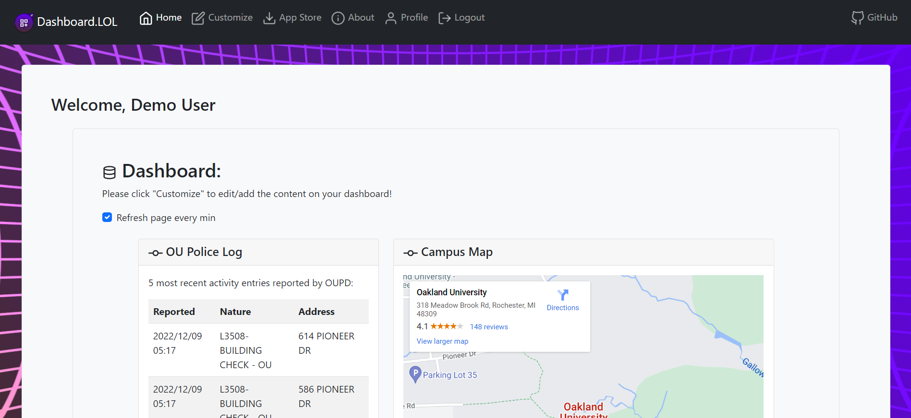
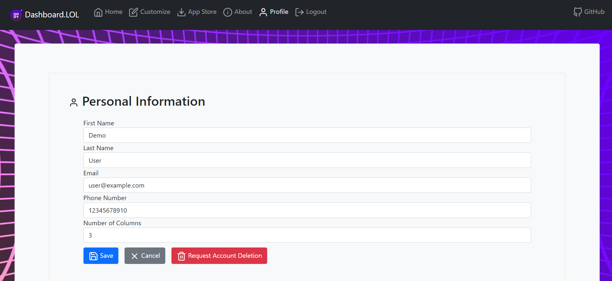
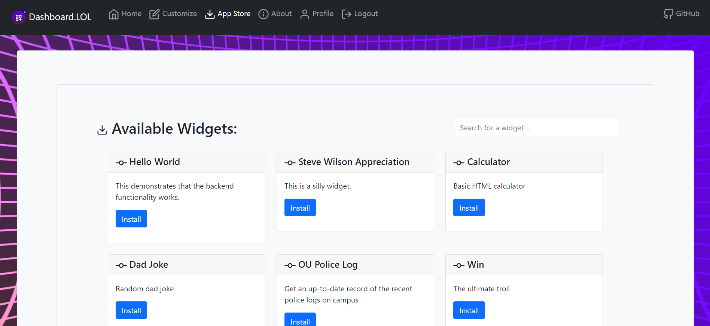
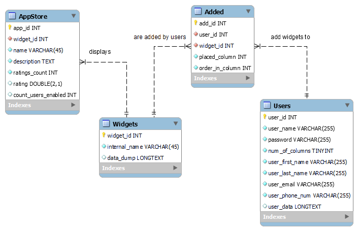

# Dashboard.lol

## Overview

Built for CSI 3450 (Database Design and Implementation) at Oakland University, the objective of this project was to build some type of application that utilizes a database and demonstrates the 4 basic SQL operations: <u>C</u>reate, <u>R</u>ead, <u>U</u>pdate, and <u>D</u>elete (CRUD).  For our project, my partner and I decided to create a customizable dashboard-type website with several widgets.  My partner handled most of the frontend, which was written in PHP, and I handled most of the backend-related tasks, which included creating and setting up the database, and writing Python code for the widgets that fetch their data from other websites.  While we were working on the project, my partner and I started looking for domains to name our website after, and we stumbled upon domains ending in `.lol`, which we thought was funny. So we bought the domain `dashboard.lol`, and that became the name of our project.

## Accessing the project

Unfortunately, the GCP VM that was hosting the project is longer up, so it can't directly be accesse, but the source code is available on my GitHub [here](https://github.com/dmocnik/dashboard.lol).

## Screenshots

<em>The main Dashboard screen</em>

<em>Editing user info, and number of columns on dashboard</em>

<em>The "widget store" where you can add and remove widgets from your dashboard</em>

<em>ER diagram of the database</em>
