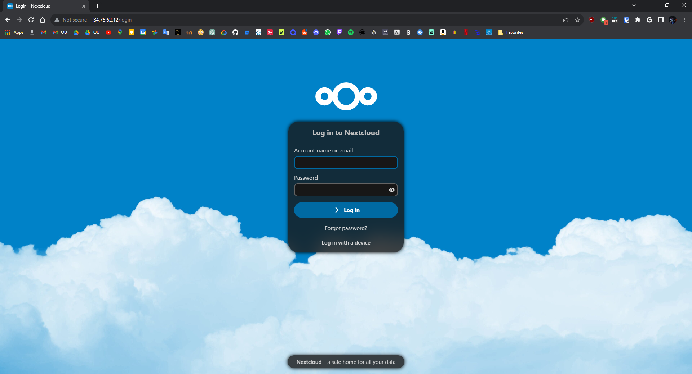
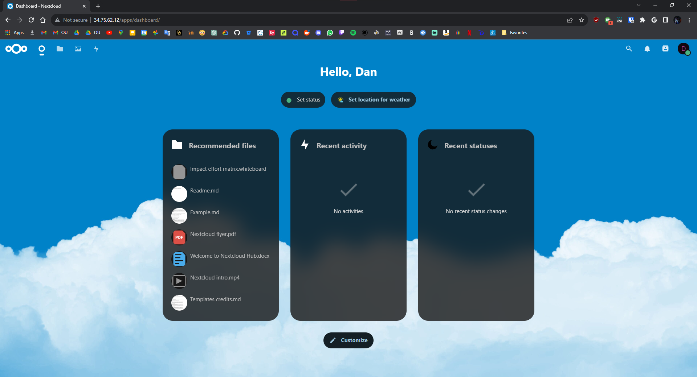
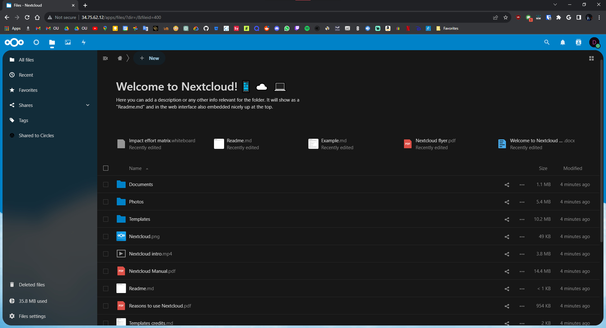
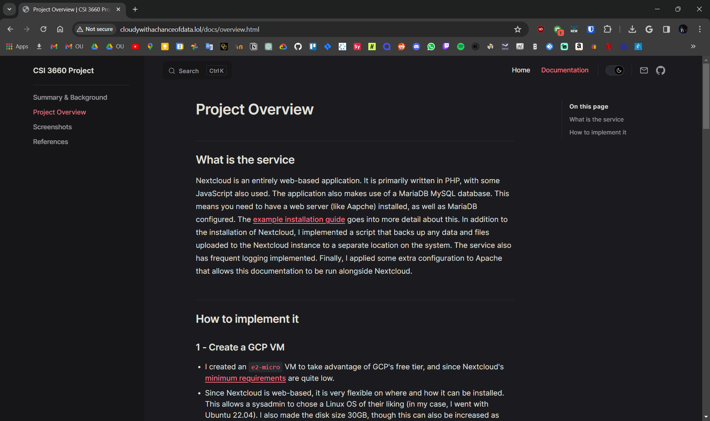

# Nextcloud

## Overview

Created for CSI 3660 (System Administration) at Oakland University, the goal of this project was to host and/or create some type of service running on a Linux VM on Google Cloud, as well as configure the server with user groups, periodic backups, and another type of automation.  In addition, we had to host documentation in the form of a website.  For my project, I decided to deploy [Nextcloud](https://nextcloud.com/), an open-source file hosting/productivity solution.

## Accessing the project

Take a look at the project at https://cloudywithachanceofdata.lol/, and view the documentation at https://cloudywithachanceofdata.lol/docs.

## Screenshots

<em>The login screen</em>

<em>The dashboard</em>

<em>Viewing some files</em>

<em>The documentation (ft. VitePress-ception)</em>
