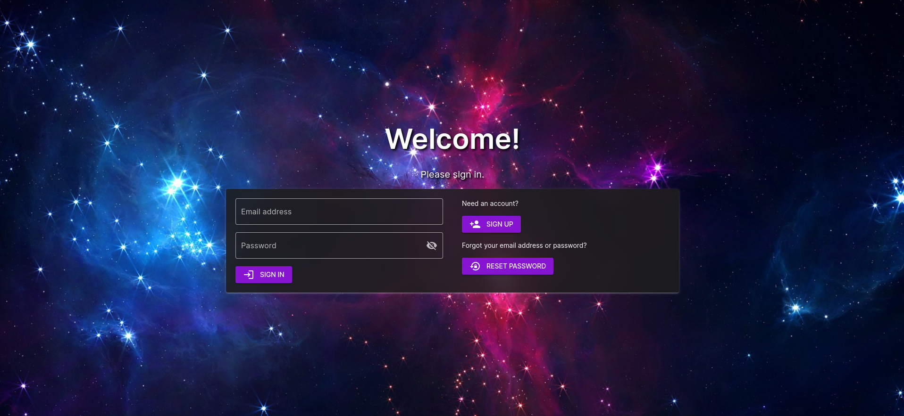
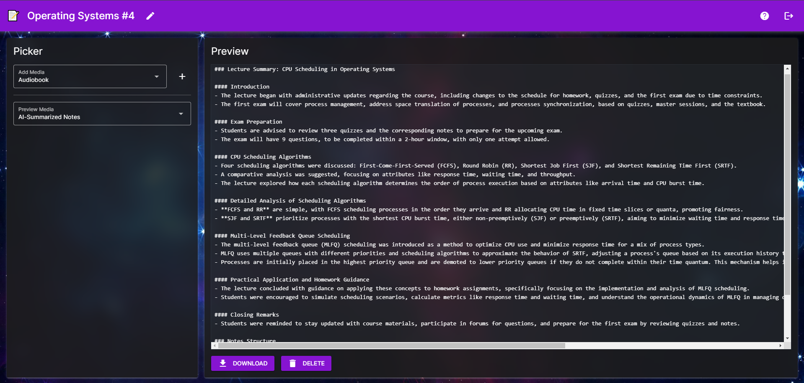

# Scribe 📝

## Overview

### Class

Senior Capstone Project (CSI 4999)

### Description

Scribe is an AI-powered transcription and summarization tool that was designed to be used for education purposes.
Users can create an account for the website, upload videos of their lectures (or other educational videos), and have them summarized by AI in several formats, such as notes pages, an "audiobook" format, or a summarized slideshow video.
The tool uses various AI services, like OpenAI's Whisper for text transcription, ChatGPT for text summarization, and ElevenLabs for the text-to-speech features.
The tool also made use of Docker and a GitHub CI/CD pipeline to automatically build the Docker image.
The project was created in a group consisting of 6 members (including myself) over a semester.
My main contribution to the project was creating the entirety of the frontend.
Going into the project, a couple of our design choices were to have it running in the browser as a web app and to have everything (including backend, frontend, and everything else) be entirely written in Python.
That's why to write the frontend, I used a Python library called [NiceGUI](https://nicegui.io/) due to its focus on creating web UIs in a Pythonic way, while also working well with our design philosophy.
We also used FastAPI and MariaDB for the backend components.

In our class's presentation competition, we took first place in Technical Impact, second place in Social Impact, and first place in Overall Project Outcome!

### Source Code

[Take a look at the source code on GitHub.](https://github.com/dmocnik/scribe)

## Screenshots

<em>Sign in/account creation page</em>

<em>"My Projects" page, where users can view and manage their lecture uploads</em>

<em>Viewing a project, where users upload their lecture, and view the various AI-generated media</em>

<em>Design Expo Poster</em>

